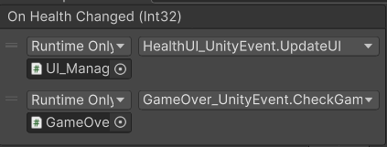

# CMCU-PhatTrienGame

## Mathematics with Unity

Project Unity mang tính học tập, nhằm hỗ trợ tìm hiểu và thực hành các khái niệm toán học cơ bản trong Unity, đặc biệt là việc làm việc với hệ tọa độ và không gian hiển thị trong game engine.

---

### Nội dung chính

- **WorldToScreen.cs**  
  Script minh họa quá trình chuyển đổi tọa độ từ *World Space* sang *Screen Space* trong Unity.

---

### Yêu cầu

- Unity phiên bản **2022 trở lên**
- .NET Framework tương thích với Unity

---

## Báo cáo SFF – Tóm tắt

### 1. Thông tin chung

- **Tên dự án:** CMCU – Phát Triển Game  
- **Công nghệ:** Unity  
- **Scene demo:** `SFF/Assets/Scenes/Demo.unity`

---

### 2. Mục tiêu

Scene `Demo.unity` được xây dựng nhằm minh họa các khái niệm toán học cơ bản trong Unity, đặc biệt là việc xử lý không gian và chuyển đổi tọa độ giữa *World Space* và *Screen Space*.

---

### 3. Chức năng chính

- Hiển thị các **GameObject** trong không gian Unity  
- Chuyển đổi tọa độ từ *World Space* sang *Screen Space* thông qua script  
- Scene có thể chạy trực tiếp và ổn định trong Unity Editor  

---

### 4. Yêu cầu phi chức năng

- Giao diện đơn giản, dễ quan sát  
- Scene chạy mượt, không phát sinh lỗi nghiêm trọng  
- Dễ mở rộng thêm các nội dung toán học khác  

---

### 5. Kiểm thử

- Scene `Demo.unity` chạy bình thường khi nhấn Play  
- Đối tượng hiển thị đúng vị trí  
- Kết quả chuyển đổi tọa độ chính xác  

**Kết quả:** Pass

---

## LAB THỰC HÀNH – CHƯƠNG 3: UNITY SCRIPTING

### 1. Mục tiêu
Mục tiêu của các bài lab trong Chương 3 là giúp sinh viên:
- Hiểu rõ vòng đời `MonoBehaviour`
- Sử dụng Vector, Quaternion và Rotation API trong Unity
- Áp dụng `SignedAngle` cho game 2D / Top-down
- Nắm vững Observer Pattern bằng C# Event và UnityEvent
- Kết hợp các kiến thức vào một mini project hoàn chỉnh

---

### 2. Môi trường phát triển
- Unity Hub
- Unity Editor: 2021 LTS hoặc 2022 LTS
- Ngôn ngữ: C#
- Template: 3D Core
- IDE: Visual Studio / Rider

---

### 3. Lab 1 – Component Lifecycle Debugger

#### Mục tiêu
Quan sát và hiểu thứ tự gọi các hàm trong vòng đời `MonoBehaviour`.

#### Nội dung thực hiện
- Tạo script ghi log các hàm:
  - `Awake`
  - `OnEnable`
  - `Start`
  - `Update`
  - `FixedUpdate`
  - `LateUpdate`
  - `OnDisable`
  - `OnDestroy`
- Thực hiện:
  - Bật / tắt GameObject (`SetActive`)
  - Instantiate object
  - Destroy object
- Quan sát log trong Console

#### Kết quả
- Hiểu rõ thứ tự lifecycle
- Phân biệt `OnEnable` và `Start`

#### Demo

---

### 4. Lab 2 – Vector Movement & Gizmos

#### Mục tiêu
- Điều khiển nhân vật bằng bàn phím WASD
- Chuẩn hóa vector để tránh di chuyển chéo nhanh hơn
- Trực quan hóa hướng di chuyển bằng Gizmos

#### Nội dung thực hiện
- Lấy input từ `Input.GetAxis`
- Tạo vector di chuyển
- Dùng `Normalize()` để chuẩn hóa
- Di chuyển bằng `transform.position`
- Vẽ Gizmos thể hiện hướng di chuyển

#### Giải thích Normalize
Nếu không chuẩn hóa, khi di chuyển chéo (W + D), độ dài vector lớn hơn → nhân vật chạy nhanh hơn.  
Normalize giúp độ dài vector luôn bằng 1, đảm bảo tốc độ đồng đều.

#### Demo

---

### 5. Lab 3 – Quaternion Rotation (Turret xoay target)

#### Mục tiêu
- Sử dụng Quaternion để xoay turret nhìn về target
- So sánh xoay trực tiếp và xoay mượt

#### Nội dung thực hiện
- Tính hướng từ turret tới target
- Dùng:
  - `LookRotation`
  - `RotateTowards`
  - `Slerp`
- So sánh:
  - Xoay tức thời
  - Xoay mượt theo thời gian

#### Demo

---

### 6. Lab 4 – Signed Angle (Top-down / 2D)

#### Mục tiêu
- Xoay nhân vật theo chuột hoặc target trong game top-down
- Hiển thị góc xoay hiện tại

#### Nội dung thực hiện
- Tính vector hướng đến target
- Sử dụng `Vector2.SignedAngle`
- Áp dụng góc xoay vào `transform.rotation`
- Hiển thị góc xoay lên UI

#### Lưu ý quan trọng
Do hướng forward của model có thể không trùng với vector gốc dùng trong `SignedAngle`, cần:
- Đảo dấu góc
- Hoặc điều chỉnh hướng local của model

#### Demo

---

### 7. Lab 5 – Observer Pattern (C# Event)

#### Mục tiêu
Áp dụng Observer Pattern bằng C# Event.

#### Nội dung thực hiện
- `PlayerHealth` đóng vai trò Subject
- Phát sự kiện `OnHealthChanged`
- Các Observer:
  - Health UI
  - Audio
  - GameOver Handler
- Nhấn phím `H` để trừ máu

#### Vấn đề gặp phải và cách khắc phục
- Gặp lỗi `NullReferenceException` trong `OnEnable`
- Nguyên nhân: Observer chưa có tham chiếu tới `PlayerHealth`
- Giải pháp:
  - Gán PlayerHealth trong Inspector
  - Hoặc tìm bằng `FindObjectOfType` trong `Awake`

#### Demo

---

### 8. Lab 6 – Observer Pattern (UnityEvent)

#### Mục tiêu
Sử dụng `UnityEvent` và binding trực tiếp trong Inspector.

#### Nội dung thực hiện
- Thay C# Event bằng `UnityEvent<int>`
- Gán các Observer thông qua Inspector
- Không cần subscribe / unsubscribe trong code

#### Ưu điểm
- Trực quan
- Dễ cấu hình
- Phù hợp với designer

#### Demo

---

### 9. Mini Project – Turret Defense Dummy

#### Mục tiêu
Kết hợp toàn bộ kiến thức của Chương 3 vào một scene hoàn chỉnh.

#### Tính năng
- Player di chuyển ổn định (Vector + Normalize)
- Turret xoay đúng hướng target (Quaternion + SignedAngle)
- Xoay mượt
- Hệ thống máu sử dụng Observer Pattern
- UI, GameOver hoạt động đúng

#### Kết quả
Mini project thể hiện đầy đủ:
- Kiến thức toán học trong game
- Vòng đời MonoBehaviour
- Event-driven architecture

#### Demo

