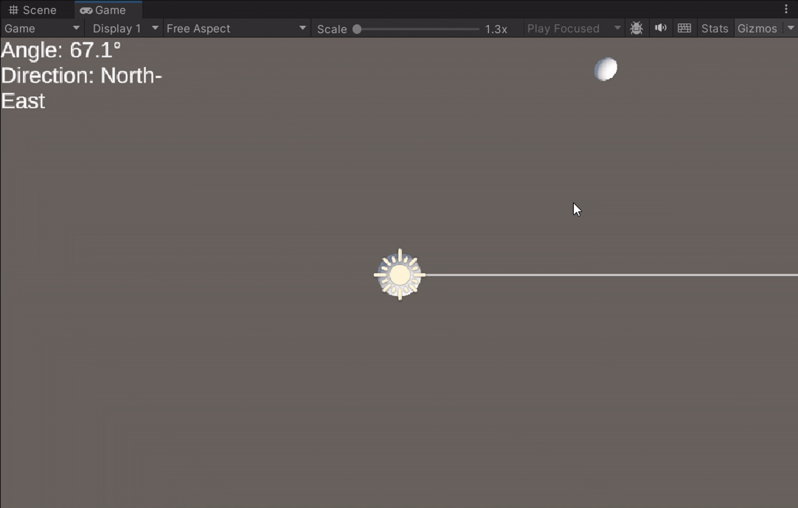

# CMCU-PhatTrienGame

## Mathematics with Unity

Project Unity mang tính học tập, nhằm hỗ trợ tìm hiểu và thực hành các khái niệm toán học cơ bản trong Unity, đặc biệt là việc làm việc với hệ tọa độ và không gian hiển thị trong game engine.

---

### Nội dung chính

- **WorldToScreen.cs**  
  Script minh họa quá trình chuyển đổi tọa độ từ *World Space* sang *Screen Space* trong Unity.

---

### Yêu cầu

- Unity phiên bản **2022 trở lên**
- .NET Framework tương thích với Unity

---

## Báo cáo SFF – Tóm tắt

### 1. Thông tin chung

- **Tên dự án:** CMCU – Phát Triển Game  
- **Công nghệ:** Unity  
- **Scene demo:** `SFF/Assets/Scenes/Demo.unity`

---

### 2. Mục tiêu

Scene `Demo.unity` được xây dựng nhằm minh họa các khái niệm toán học cơ bản trong Unity, đặc biệt là việc xử lý không gian và chuyển đổi tọa độ giữa *World Space* và *Screen Space*.

---

### 3. Chức năng chính

- Hiển thị các **GameObject** trong không gian Unity  
- Chuyển đổi tọa độ từ *World Space* sang *Screen Space* thông qua script  
- Scene có thể chạy trực tiếp và ổn định trong Unity Editor  

---

### 4. Yêu cầu phi chức năng

- Giao diện đơn giản, dễ quan sát  
- Scene chạy mượt, không phát sinh lỗi nghiêm trọng  
- Dễ mở rộng thêm các nội dung toán học khác  

---

### 5. Kiểm thử

- Scene `Demo.unity` chạy bình thường khi nhấn Play  
- Đối tượng hiển thị đúng vị trí  
- Kết quả chuyển đổi tọa độ chính xác  

**Kết quả:** Pass

---

## LAB THỰC HÀNH – CHƯƠNG 3: UNITY SCRIPTING

### 1. Mục tiêu
Mục tiêu của các bài lab trong Chương 3 là giúp sinh viên:
- Hiểu rõ vòng đời `MonoBehaviour`
- Sử dụng Vector, Quaternion và Rotation API trong Unity
- Áp dụng `SignedAngle` cho game 2D / Top-down
- Nắm vững Observer Pattern bằng C# Event và UnityEvent
- Kết hợp các kiến thức vào một mini project hoàn chỉnh

---

### 2. Môi trường phát triển
- Unity Hub
- Unity Editor: 2021 LTS hoặc 2022 LTS
- Ngôn ngữ: C#
- Template: 3D Core
- IDE: Visual Studio / Rider

---

### 3. Lab 1 – Component Lifecycle Debugger

#### Demo

---

### 4. Lab 2 – Vector Movement & Gizmos

#### Demo

---

### 5. Lab 3 – Quaternion Rotation (Turret xoay target)

#### Demo

---

### 6. Lab 4 – Signed Angle (Top-down / 2D)

#### Image

#### Demo
##### Theo chuột

##### Theo Target

---

### 7. Lab 5 – Observer Pattern (C# Event)

#### Demo

---

### 8. Lab 6 – Observer Pattern (UnityEvent)

#### Image

#### Demo

---

### 9. Mini Project – Turret Defense Dummy
#### Demo

