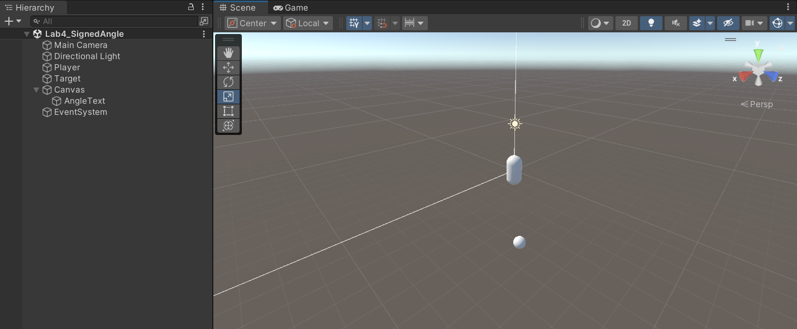
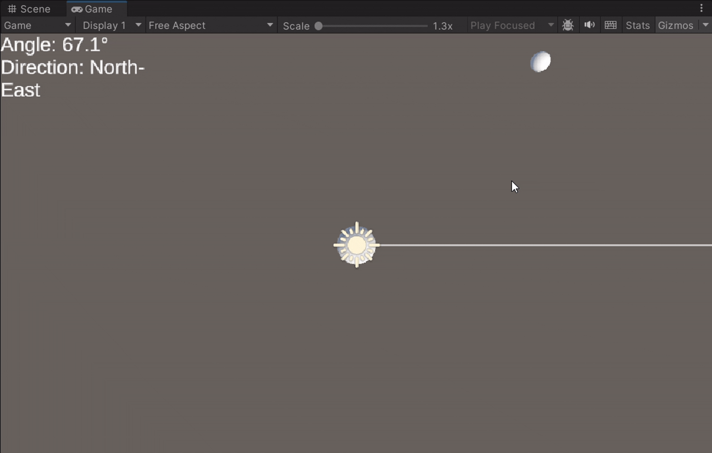
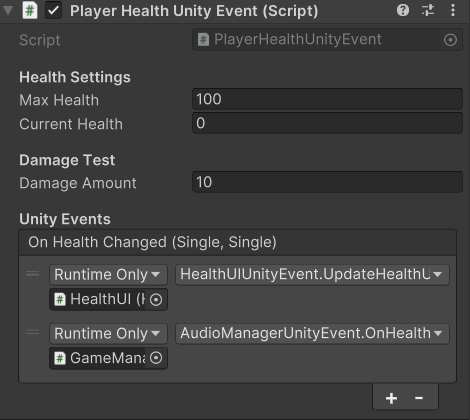

# CMCU-PhatTrienGame

## Mathematics with Unity

Project Unity mang tính học tập, nhằm hỗ trợ tìm hiểu và thực hành các khái niệm toán học cơ bản trong Unity, đặc biệt là việc làm việc với hệ tọa độ và không gian hiển thị trong game engine.

---

### Nội dung chính

- **WorldToScreen.cs**  
  Script minh họa quá trình chuyển đổi tọa độ từ *World Space* sang *Screen Space* trong Unity.

---

### Yêu cầu

- Unity phiên bản **2022 trở lên**
- .NET Framework tương thích với Unity

---

## Báo cáo SFF – Tóm tắt

### 1. Thông tin chung

- **Tên dự án:** CMCU – Phát Triển Game  
- **Công nghệ:** Unity  
- **Scene demo:** `SFF/Assets/Scenes/Demo.unity`

---

### 2. Mục tiêu

Scene `Demo.unity` được xây dựng nhằm minh họa các khái niệm toán học cơ bản trong Unity, đặc biệt là việc xử lý không gian và chuyển đổi tọa độ giữa *World Space* và *Screen Space*.

---

### 3. Chức năng chính

- Hiển thị các **GameObject** trong không gian Unity  
- Chuyển đổi tọa độ từ *World Space* sang *Screen Space* thông qua script  
- Scene có thể chạy trực tiếp và ổn định trong Unity Editor  

---

### 4. Yêu cầu phi chức năng

- Giao diện đơn giản, dễ quan sát  
- Scene chạy mượt, không phát sinh lỗi nghiêm trọng  
- Dễ mở rộng thêm các nội dung toán học khác  

---

### 5. Kiểm thử

- Scene `Demo.unity` chạy bình thường khi nhấn Play  
- Đối tượng hiển thị đúng vị trí  
- Kết quả chuyển đổi tọa độ chính xác  

**Kết quả:** Pass

---

## LAB THỰC HÀNH – CHƯƠNG 3: UNITY SCRIPTING

### 1. Mục tiêu
Mục tiêu của các bài lab trong Chương 3 là giúp sinh viên:
- Hiểu rõ vòng đời `MonoBehaviour`
- Sử dụng Vector, Quaternion và Rotation API trong Unity
- Áp dụng `SignedAngle` cho game 2D / Top-down
- Nắm vững Observer Pattern bằng C# Event và UnityEvent
- Kết hợp các kiến thức vào một mini project hoàn chỉnh

---

### 2. Môi trường phát triển
- Unity Hub
- Unity Editor: 2021 LTS hoặc 2022 LTS
- Ngôn ngữ: C#
- Template: 3D Core
- IDE: Visual Studio / Rider

---

### 3. Lab 1 – Component Lifecycle Debugger

#### Demo


---

### 4. Lab 2 – Vector Movement & Gizmos

#### Demo


---

### 5. Lab 3 – Quaternion Rotation (Turret xoay target)

#### Demo


---

### 6. Lab 4 – Signed Angle (Top-down / 2D)

#### Image



#### Demo
##### Theo chuột


##### Theo Target


---

### 7. Lab 5 – Observer Pattern (C# Event)

#### Demo


---

### 8. Lab 6 – Observer Pattern (UnityEvent)

#### Image


#### Demo


---

### 9. Mini Project – Turret Defense Dummy
#### Demo


---

## BÁO CÁO THỰC HÀNH CHƯƠNG 4: AUDIO & VIDEO (UNITY)
#### Các demo video được để ở Asset/Video

---

### 1. Mục tiêu

- Nắm vững hệ thống Audio: AudioSource, AudioListener, AudioClip
- Hiểu và áp dụng Spatial Audio (2D/3D)
- Làm việc với VideoPlayer và events
- Xây dựng intro cutscene hoàn chỉnh

---

### 2. Kết quả các Labs

#### Lab 1: AudioSource Cơ Bản
**Kết quả:** 
- ✓ Tạo AudioSource với điều khiển bằng phím (Space: Play, S: Stop)
- ✓ Play On Awake = OFF hoạt động đúng
- ✓ Script AudioController chạy ổn định

**Ứng dụng:** Sound effects trong game (tiếng súng, bước chân, interaction)

#### Lab 2: Audio 2D vs 3D
**Kết quả:**
- ✓ Audio 2D (Spatial Blend = 0): Âm lượng không đổi theo vị trí
- ✓ Audio 3D (Spatial Blend = 1): Âm lượng thay đổi theo khoảng cách
- ✓ Cấu hình Min/Max Distance ảnh hưởng rõ rệt

**Kết luận:**
- **2D Audio:** Background music, UI sounds, narration
- **3D Audio:** Tiếng bước chân, môi trường, NPC voices

#### Lab 3: Điều Khiển Audio Toàn Cục
**Kết quả:**
- ✓ Phím M: Mute/Unmute (AudioListener.volume)
- ✓ Phím P: Pause/Resume (AudioListener.pause)
- ✓ Áp dụng được cho Settings Menu

#### Lab 4: AudioClip Optimization
**Cấu hình tối ưu:**

| Loại Audio | Load Type | Compression | Lý do |
|------------|-----------|-------------|-------|
| BGM dài | Streaming | Vorbis | Tiết kiệm RAM |
| SFX ngắn | Decompress On Load | PCM | Phát nhanh |
| SFX trung bình | Compressed In Memory | ADPCM | Cân bằng |

**Kết quả:** Giảm ~60% file size, performance tốt

#### Lab 5: VideoPlayer Cơ Bản
**Kết quả:**
- ✓ Import video .mp4 thành công
- ✓ Phím V để play video
- ✓ 60 FPS ổn định, không desync

#### Lab 6: Video Render Target
**Phương pháp thực hiện:**
- **Method 1:** RenderTexture + UI RawImage → Phù hợp cutscene fullscreen
- **Method 2:** Material Override trên 3D Object → Phù hợp TV screen in-game

**Kết quả:** Cả 2 phương pháp hoạt động tốt

#### Lab 7: Video Events & Control
**Events đã implement:**
- `prepareCompleted`: Video sẵn sàng → Auto play
- `loopPointReached`: Video kết thúc → Hiện UI + chuyển scene
- `errorReceived`: Xử lý lỗi

**Kết quả:**
- ✓ Events kích hoạt đúng
- ✓ Scene transition mượt mà
- ✓ Không memory leak

---

### 3. Mini Project: Intro Cutsence

#### Tính năng đã hoàn thành:
✓ **Video Intro:** Tự động phát, RenderTexture fullscreen, 60 FPS  
✓ **BGM:** Đồng bộ với video, fade out khi kết thúc  
✓ **Skip Button:** Click hoặc Space/ESC để bỏ qua  
✓ **Fade Effects:** Fade in 1s, fade out mượt mà  
✓ **Auto Transition:** Tự chuyển scene khi video hết  

#### Code highlights:
```csharp
// IntroCutsceneManager.cs
- Event-driven: prepareCompleted, loopPointReached
- Coroutine fade effects
- Proper cleanup (unregister events)
- Error handling & validation
```

#### Testing:
- ✓ Video auto-play: PASS
- ✓ BGM sync: PASS
- ✓ Skip functionality: PASS
- ✓ Fade smooth: PASS
- ✓ Performance: 60 FPS, ~150MB RAM

---

### 4. Nhận xét

#### Điểm mạnh:
✓ Hiểu rõ 2D/3D Audio và ứng dụng  
✓ Làm chủ VideoPlayer events  
✓ Code clean, có comments đầy đủ  
✓ Mini project chạy ổn định  

#### Điểm cần cải thiện:
- Chưa có AudioMixer groups
- Chưa implement subtitle system
- Chưa optimize cho mobile

#### Kiến thức học được:
- **Audio:** Spatial Audio, optimization, global control
- **Video:** Events, RenderTexture, optimization
- **Coding:** Event-driven, coroutines, error handling
- **Workflow:** Testing, debugging, documentation

#### Ứng dụng thực tế:
- Intro/outro cutscenes
- Tutorial videos in-game
- TV screens, security cameras
- Training simulations

---

## 5. Kết luận

Qua bài lab, đã nắm vững được Audio & Video system trong Unity từ cơ bản đến nâng cao. Mini project intro cutscene hoạt động professional với đầy đủ features: video, audio, UI, transitions.

**Thành tựu:**
- ✓ Hiểu sâu AudioSource, AudioListener, Spatial Audio
- ✓ Làm chủ VideoPlayer và events
- ✓ Xây dựng sản phẩm chất lượng tốt

**Hướng phát triển:**
- Thêm AudioMixer cho audio groups
- Implement subtitle system
- Optimize cho mobile
- Adaptive music system

---

## LAB THỰC HÀNH – CHƯƠNG 5: PHYSICS (UNITY)

### DEMO SẢN PHẨM: LabC5/Demo
### 📋 MỤC TIÊU LAB

Nắm vững hệ thống Physics trong Unity, bao gồm:
- Collider 2D/3D
- Rigidbody 2D/3D
- Effector 2D
- Character Controller
- Collision & Trigger Events
- Physics Material

---

### CHI TIẾT CÁC LAB

#### **Lab 1 – Collider 2D Cơ Bản**

**Mục tiêu:** Hiểu và sử dụng các loại Collider2D

**Thực hiện:**
- Tạo scene 2D với Ground
- Tạo Player với Box Collider 2D
- Tạo Obstacle với Circle Collider 2D
- Tạo Obstacle với Polygon Collider 2D
- Quan sát va chạm giữa các object

---

#### **Lab 2 – Rigidbody 2D & Collision Event**

**Mục tiêu:** Xử lý sự kiện va chạm và trigger

**Thực hiện:**
- Gắn Rigidbody2D cho Player
- Xử lý `OnCollisionEnter2D`, `OnCollisionStay2D`, `OnCollisionExit2D`
- Xử lý `OnTriggerEnter2D`, `OnTriggerStay2D`, `OnTriggerExit2D`
- Log thông tin ra Console

**Scripts:**
- `PlayerCollision.cs` - Xử lý collision events
- `TriggerDetector.cs` - Xử lý trigger events

---

#### **Lab 3 – Physics Material 2D**

**Mục tiêu:** So sánh các loại Physics Material

**Thực hiện:**
- Tạo `Bouncy_Material` (Friction: 0, Bounciness: 1)
- Tạo `Slippery_Material` (Friction: 0, Bounciness: 0)
- Tạo 3 ball với material khác nhau
- So sánh chuyển động khi rơi và nảy

---

#### **Lab 4 – Effector 2D**

**Mục tiêu:** Sử dụng Platform Effector và Surface Effector

**Thực hiện:**

**Platform Effector 2D (One-Way Platform):**
- Tạo platform có thể nhảy qua từ dưới lên
- Surface Arc: 180°
- Use One Way: TRUE

**Surface Effector 2D (Băng chuyền):**
- Tạo băng chuyền tự động di chuyển vật thể
- Speed: 5
- Direction: Vector3.forward

**Scripts:**
- `PlayerJump.cs` - Nhân vật nhảy

---

#### **Lab 5 – Collider & Rigidbody 3D**

**Mục tiêu:** Làm việc với Physics 3D và AddForce

**Thực hiện:**
- Tạo scene 3D với Ground (Plane)
- Tạo Cube với Box Collider + Rigidbody
- Tạo Sphere với Sphere Collider + Rigidbody
- Sử dụng `AddForce()` để đẩy vật thể

**Scripts:**
- `ForceApplier.cs` - Áp dụng lực cho vật thể
  - Space: Đẩy lên
  - W: Đẩy về phía trước

---

#### **Lab 6 – Trigger vs Collision (3D)**

**Mục tiêu:** Hiểu rõ sự khác biệt giữa Trigger và Collision

**Thực hiện:**
- Tạo CollisionWall (Is Trigger = FALSE)
- Tạo TriggerZone (Is Trigger = TRUE)
- So sánh hành vi khi Player tương tác

**Scripts:**
- `TriggerVsCollision.cs` - Log và so sánh events
- `PlayerMove.cs` - Di chuyển Player (WASD)

**So sánh:**

| Đặc điểm | Collision | Trigger |
|----------|-----------|---------|
| Is Trigger | ☐ FALSE | ☑ TRUE |
| Đi qua được | ❌ Không | ✅ Có |
| Có lực cản | ✅ Có | ❌ Không |
| Events | OnCollisionEnter/Stay/Exit | OnTriggerEnter/Stay/Exit |
| Sử dụng | Tường, sàn, vật cản | Cửa tự động, checkpoint |

---

#### **Lab 7 – Character Controller**

**Mục tiêu:** Sử dụng Character Controller cho nhân vật

**Thực hiện:**
- Tạo nhân vật với Character Controller (KHÔNG dùng Rigidbody)
- Sử dụng `Move()` để di chuyển
- Thiết lập Step Offset: 0.3 (leo cầu thang)
- Thiết lập Slope Limit: 45 (lên dốc)
- Tạo cầu thang (5 bậc)
- Tạo dốc (30-45 độ)

**Scripts:**
- `CharacterMove.cs` - Di chuyển mượt mà
  - WASD: Di chuyển
  - Space: Nhảy
  - Gravity: -15f

---

#### **Mini Project – Physics Demo Scene**

**Mục tiêu:** Tổng hợp tất cả kiến thức Physics

**Scripts:**
- `CharacterMove.cs` - Di chuyển Player
- `OneWayPlatform.cs` - Platform nhảy qua từ dưới lên
- `Conveyor.cs` - Băng chuyền tự động đẩy vật thể

---

### HƯỚNG DẪN CHẠY PROJECT

#### **Yêu cầu hệ thống:**
- Unity Editor: 2021.3 LTS trở lên
- OS: Windows/macOS/Linux

#### **Cách mở project:**

```bash
# Clone repository
git clone https://github.com/Thsngk5/CMCU-PhatTrienGame.git

# Mở Unity Hub
# Add Project → Chọn thư mục LabC5
# Mở project
```

#### **Cách test từng Lab:**

1. Mở Unity Editor
2. File → Open Scene
3. Chọn scene tương ứng (Lab1_Collider2D.unity, Lab2_..., v.v.)
4. Bấm Play (Ctrl + P)
5. Sử dụng các phím điều khiển:
   - **WASD**: Di chuyển
   - **Space**: Nhảy
   - **Mũi tên**: Di chuyển (một số lab)

---

### KIẾN THỨC CƠ BẢN VỀ PHYSICS TRONG UNITY

#### Collider - Vùng va chạm

**Khái niệm:** Collider là component định nghĩa hình dạng vật lý của GameObject, xác định vùng mà object có thể va chạm với các object khác.

**Các loại Collider:**

**2D:**
- **Box Collider 2D:** Hình chữ nhật, phù hợp cho platform, tường, hộp
- **Circle Collider 2D:** Hình tròn, phù hợp cho ball, coin
- **Polygon Collider 2D:** Hình dạng tùy chỉnh theo sprite, phù hợp cho địa hình phức tạp

**3D:**
- **Box Collider:** Hình hộp chữ nhật
- **Sphere Collider:** Hình cầu
- **Capsule Collider:** Hình viên nén, thường dùng cho nhân vật
- **Mesh Collider:** Theo hình dạng 3D model, chi tiết nhất nhưng tốn tài nguyên

---

#### Rigidbody - Vật lý động

**Khái niệm:** Rigidbody là component cho phép GameObject chịu tác động của lực vật lý như trọng lực, lực đẩy, va chạm.

**Thuộc tính quan trọng:**
- **Mass:** Khối lượng (kg), ảnh hưởng đến độ nặng khi va chạm
- **Drag:** Lực cản không khí, giảm vận tốc
- **Angular Drag:** Lực cản khi xoay
- **Use Gravity:** Bật/tắt trọng lực
- **Is Kinematic:** Nếu bật, object không chịu lực vật lý nhưng có thể di chuyển bằng code

---

#### Collision vs Trigger

**Collision (Is Trigger = FALSE):**
- Vật thể va chạm thực tế, không đi qua được
- Có phản lực (bouncing, pushing)
- Sử dụng cho: tường, sàn, vật cản
- Events: `OnCollisionEnter`, `OnCollisionStay`, `OnCollisionExit`

**Trigger (Is Trigger = TRUE):**
- Vật thể đi qua được, chỉ phát hiện sự hiện diện
- Không có phản lực
- Sử dụng cho: cửa tự động, checkpoint, vùng kích hoạt
- Events: `OnTriggerEnter`, `OnTriggerStay`, `OnTriggerExit`

**So sánh thực tế (Lab 6):**

| Tình huống | Collision | Trigger |
|------------|-----------|---------|
| Player chạm tường đỏ | Bị chặn lại | - |
| Player vào vùng xanh | - | Đi qua, log "Phát hiện" |
| Ứng dụng | Tường nhà, mặt đất | Cửa tự động, điểm lưu game |

---

#### Physics Material

**Khái niệm:** Material định nghĩa tính chất bề mặt: ma sát và độ nảy.

**Thuộc tính:**
- **Friction (0-1):** Ma sát, càng cao càng khó trượt
- **Bounciness (0-1):** Độ nảy, càng cao càng nảy mạnh

---

#### Effector 2D

**Platform Effector 2D (Nền một chiều):**
- Cho phép nhân vật nhảy qua platform từ dưới lên
- Khi đứng trên không bị rơi xuống
- **Use One Way:** TRUE
- **Surface Arc:** 180°

---

#### Character Controller

**Khái niệm:** Component chuyên dụng cho nhân vật người chơi, KHÔNG dùng Rigidbody.

**Ưu điểm:**
- Di chuyển mượt mà, không bị lật ngã
- Leo cầu thang tự động (Step Offset)
- Lên dốc dễ dàng (Slope Limit)
- Kiểm soát tốt hơn Rigidbody

**Thuộc tính quan trọng:**
- **Height:** Chiều cao nhân vật
- **Radius:** Bán kính
- **Step Offset (0.3):** Độ cao tối đa có thể leo (cầu thang)
- **Slope Limit (45):** Độ dốc tối đa có thể lên

---

### BẢN TỔNG KẾT PHYSICS

| Component | Mục đích | Khi nào dùng |
|-----------|----------|--------------|
| **Collider** | Xác định vùng va chạm | Tất cả object cần va chạm |
| **Rigidbody** | Vật lý động | Vật thể rơi, bị đẩy, chịu lực |
| **Character Controller** | Điều khiển nhân vật | Player, NPC di chuyển |
| **Physics Material** | Tính chất bề mặt | Ball nảy, mặt trượt |
| **Trigger** | Phát hiện vùng | Cửa, checkpoint, item |

**Nguyên tắc sử dụng:**
1. Mọi object cần va chạm phải có **Collider**
2. Object chịu lực vật lý cần **Rigidbody**
3. Player nên dùng **Character Controller** thay vì Rigidbody
4. Tường, sàn không cần Rigidbody (static collider)
5. Dùng **Trigger** cho vùng phát hiện, **Collision** cho vật cản thực
